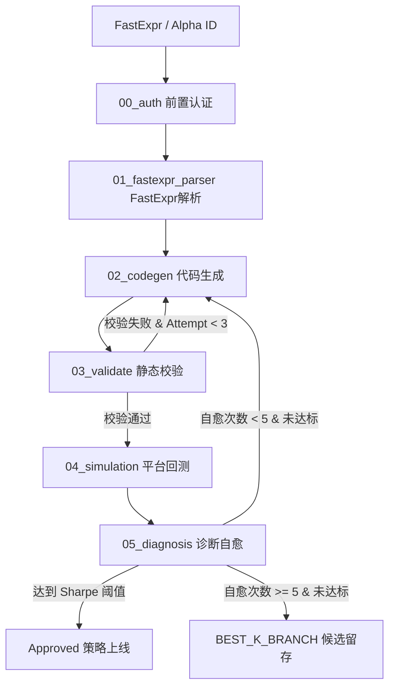

# PythonAlpha

FastExpr → WQ Brain Python Alpha 自动化流水线。

## 架构



### 节点说明

| 节点 | 类型 | 输出 | 说明 |
|------|------|------|------|
| 00_auth | 确定性 | `auth_status.json` | WQ Brain 认证 |
| 01_fastexpr_parser | Agentic | `strategy_spec.json` | 解析 FastExpr 为结构化策略描述 |
| 02_codegen | Agentic | `alphas.py` | 生成 WQ Brain Python Alpha 代码 |
| 03_validate | 确定性 | `validation_results.json` | AST 静态分析验证 |
| 04_simulation | 确定性 | `simulation_results.json` | 提交回测并轮询结果 |
| 05_diagnosis | Agentic | `diagnosis.json` | 评估指标，路由自愈或结束 |

## 快速开始

```bash
# 安装依赖
uv sync

# 初始化 pipeline run
uv run python3 pipeline/scripts/init_run.py

# 手动设置 node_input.json 和 strategy_spec.json 后依次执行节点：
uv run python3 pipeline/nodes/02_codegen/run.py --run-dir pipeline_runs/<run_id>
uv run python3 pipeline/nodes/03_validate/run.py --run-dir pipeline_runs/<run_id>
uv run python3 pipeline/nodes/04_simulation/run.py --run-dir pipeline_runs/<run_id>
uv run python3 pipeline/nodes/05_diagnosis/run.py --run-dir pipeline_runs/<run_id>
```

## 01_fastexpr_parser 节点

两种输入模式：

**模式 (a) — 直接输入 FastExpr：**
```json
{
  "fastexpr": "group_neutralize(ts_mean(winsorize(ts_backfill((close / open), 120), std=4), 120), densify(sector))"
}
```

**模式 (b) — 输入 Alpha ID：**
```json
{
  "alpha_id": "Xg150eEb"
}
```

节点从 WQ Brain API 拉取 Alpha 详情，提取 `regular.code`（FastExpr）。

## 配置文件

`config.json`：

```json
{
    "pipeline": { "region": "USA", "universe": "TOP3000", "delay": "1" },
    "thresholds": { "min_sharpe": 1.58, "min_fitness": 1.0, "max_turnover": 0.5 },
    "budgets": { "max_simulation_count": 10, "max_self_heal_iterations": 5 }
}
```

## 凭证

在 `.env` 中配置：

```
BRAIN_EMAIL=your@email.com
BRAIN_PASSWORD=your_password
```

## 参考子模块

`wqb_cli/` — WQ Brain 平台 API 的 CLI 封装（[untuitivist/wqb_cli](https://github.com/untuitivist/wqb_cli)），作为开发新功能时的 API 导航参考。
